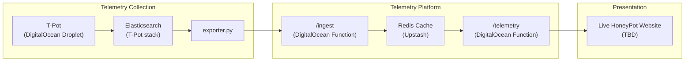

# Live HoneyPot Telemetry Pipeline

A lightweight security telemetry pipeline that collects, summarizes, and publishes data from an internet-facing T-Pot honeypot.

The project periodically exports summarized telemetry from Elasticsearch, publishes it through DigitalOcean Functions, stores it in Upstash Redis, and exposes a simple read API consumed by the Live HoneyPot website.

The design intentionally favors lightweight reporting over exposing Elasticsearch directly.

---

## Project Status

v0.1.0 - Proof of Concept

Current capabilities:

- Live telemetry publishing
- Daily and latest reports
- Serverless API
- Frontend integration

The project is actively evolving.

---

## Live Demo

A live telemetry feed is available at:

https://your-domain.example

The dashboard displays summarized telemetry generated from the honeypot environment.

---

## Features

- Scheduled telemetry export
- Daily and latest report generation
- Serverless ingestion API
- Upstash Redis caching
- Internal function cache for low-latency reads
- Lightweight JSON API designed for static frontend consumption
- Static frontend integration

---

## Architecture




## Technology Stack

- Honeypot Platform: T-Pot
- Honeypot Hosting: DigitalOcean Droplet
- SIEM / Storage: Elasticsearch
- Exporter: Python
- API: DigitalOcean Functions
- Cache: Upstash Redis
- Frontend: Static website hosted on GitHub Pages

---

## Why this architecture?

Instead of allowing the frontend to query Elasticsearch directly, telemetry is periodically summarized into small JSON reports.

Benefits include:

- Reduced infrastructure exposure
- Stable API
- Lower bandwidth
- Lower latency
- Better cacheability
- Easy future migration to additional data sources

---

## Design Decisions

### Export summaries instead of exposing Elasticsearch

The website consumes small JSON reports rather than querying Elasticsearch directly. This reduces complexity, limits infrastructure exposure, and provides a stable API.

### Separate report type from report contents

Reports include metadata describing how they should be interpreted (`latest`, `daily`) rather than inferring semantics from timestamps alone.

### Two-level cache

Upstash Redis provides shared persistence, while DigitalOcean Function instances maintain a short-lived in-memory cache to reduce Redis reads.

---

## Repository Structure

```
.
├── runner          # Telemetry export and scheduling
│   ├── exporter.py
│   ├── executor.sh
│   └── crontab.txt
├── backend         # DigitalOcean Functions
│   ├── project.yml
│   └── packages
│       └── live-telemetry
│           ├── ingest
│           │   └── ingest.js
│           └── telemetry
│               └── telemetry.js
```

---

## Data Flow

1. Cron executes `executor.sh`
2. `exporter.py` queries Elasticsearch
3. Report JSON is generated
4. Report is POSTed to `/ingest`
5. `/ingest` validates and stores data in Upstash
6. Website requests `/telemetry`
7. `/telemetry` serves cached telemetry

---

## Report Types

Currently supported:

| Report Type | Description |
|-------------|-------------|
| latest | Most recent telemetry snapshot covering the previous 24 hours |
| daily | Calendar-day report (00:00–00:00 UTC) |

Future report types may include weekly and monthly summaries.

---

## Caching

Two cache layers are used.

### Upstash Redis

Shared cache across all function instances.

### Internal Function Cache

Warm DigitalOcean Function instances cache recently requested reports in memory to reduce Redis requests.

---

## Configuration

Configuration is provided through environment variables.

Examples include:

- Elasticsearch connection
- Upstash URL
- Upstash token
- TTL values
- Report mode

No secrets are committed to the repository.

---

## Project Goals

This repository is part of the Live HoneyPot project.

Goals include:

- Operate a real internet-facing honeypot
- Publish useful telemetry
- Document engineering decisions
- Share practical security knowledge
- Learn detection engineering through real data

---

## Future Work

- Historical telemetry API
- Multiple honeypots
- Public dashboard
- Additional report types
- More detection-oriented summaries

---

## Feedback and Collaboration

Live HoneyPot is an ongoing security engineering project.

Questions, feedback, ideas, and discussions about honeypots, telemetry analysis, or detection engineering are welcome.

Feel free to open an issue or reach out.